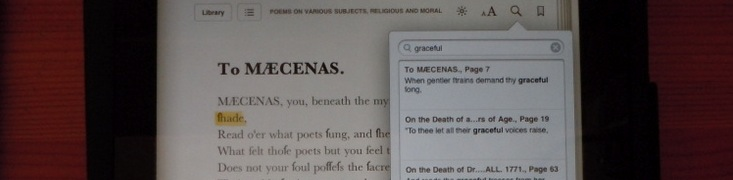

English 3345:
=============
African-American Literature
=============

## *The Early Writers, Electronic Literature, and Deep Reading*  ##

###Reading list

>1. ***Poems on Various Subjects, Religious and Moral***   by Phillis Wheatley
2. ***The Collected Works of Jupiter Hammon***   edited by Cedrick May       
3. ***A Narrative of the Life and Adventures of Venture, a Native of Africa*** by Venture Smith                                                             
4. ***My Bondage and My Freedom***  by Frederick Douglass
5. ***Incidents in the Life of a Slave Girl***  by Harriet Jacobs 
6. ***The Souls of Black Folk***  by W.E.B. Du Bois. 
7. ***[Why We Can't Wait](http://www.amazon.com/Cant-Wait-King-Legacy-ebook/dp/B004FEG3BM/ref=sr_1_1?s=digital-text&ie=UTF8&qid=1358207724&sr=1-1&keywords=why+we+can%27t+wait)***  by Martin Luther King Jr.**
8. ***[Kindred](http://www.amazon.com/Kindred-Bluestreak-ebook/dp/B001T4Z82Q/ref=sr_1_2?ie=UTF8&qid=1358207640&sr=8-2&keywords=kindred)***  by Octavia Butler**
9. ***Assigned Daily Blogpost Readings***

>>**These are ebooks that you will be required to purchase and load onto your ebook reader

>>[All other ebooks listed can be downloaded using this link](https://dl.dropbox.com/u/16071837/engl3345_spring2013/syllabus_engl_3345-whole.pdf)

--------------------------

>* __Instructor: Dr. C. May__&nbsp;&nbsp;&nbsp;&nbsp;&nbsp;&nbsp;&nbsp;&nbsp;&nbsp;&nbsp;&nbsp;&nbsp;&nbsp;&nbsp;&nbsp;&nbsp;&nbsp;&nbsp;&nbsp;&nbsp;&nbsp;&nbsp;&nbsp;&nbsp;&nbsp;&nbsp;&nbsp;&nbsp;&nbsp;&nbsp;&nbsp;&nbsp;&nbsp;&nbsp;__email: cedrickmay@uta.edu__

>> __Tuesdays & Thursdays__	&nbsp;&nbsp;&nbsp;&nbsp;&nbsp;&nbsp;&nbsp;&nbsp;&nbsp;&nbsp;&nbsp;&nbsp;&nbsp;&nbsp;&nbsp;&nbsp;&nbsp;&nbsp;&nbsp;&nbsp;&nbsp;&nbsp;&nbsp;&nbsp;&nbsp;&nbsp;&nbsp;&nbsp;&nbsp;&nbsp;&nbsp;&nbsp;&nbsp;&nbsp;&nbsp;&nbsp;&nbsp; __Office Hours__&nbsp;&nbsp;&nbsp;&nbsp;&nbsp;&nbsp;&nbsp;

>* Section 1 9:30-10:50am&nbsp;&nbsp;&nbsp;&nbsp;&nbsp;&nbsp;&nbsp;&nbsp;&nbsp;&nbsp;&nbsp;&nbsp;&nbsp;&nbsp;&nbsp;&nbsp;&nbsp;&nbsp;&nbsp;&nbsp;&nbsp;&nbsp;&nbsp;&nbsp;&nbsp;&nbsp;&nbsp;&nbsp;&nbsp;&nbsp;&nbsp;&nbsp;&nbsp;&nbsp;&nbsp;Tu & TH 1:00-2:30
* Section 2 11:00-12:50 pm&nbsp;&nbsp;&nbsp;&nbsp;&nbsp;&nbsp;&nbsp;&nbsp;&nbsp;&nbsp;&nbsp;&nbsp;&nbsp;&nbsp;&nbsp;&nbsp;&nbsp;&nbsp;&nbsp;&nbsp;&nbsp;&nbsp;&nbsp;&nbsp;&nbsp;&nbsp;&nbsp;&nbsp;&nbsp;&nbsp;&nbsp;Carlisle Hall, Room 610

---------------------------

###Course Description

ENGLISH 3345: ELECTRONIC AFRICAN-AMERICAN LITERATURE

This course is designed to familiarize students with various
novels, autobiographies, poetry, and short fiction of African
American writers from 1760 to the beginning of the 20th
century. We will study a number of genres throughout the
semester, including poetry, sermons, slave narratives, essays
and science fiction. All of the texts for this course will be
in electronic form, so students will be required to have a
portable electronic eBook reader (such as a Kindle, Nook, Sony
reader, etc.).

One of the major goals of the course is to introduce students
to a new way of looking at the African American literary
tradition by examining how black writers embrace and then
further develop earlier traditions within the canon.  The
course also looks toward the future of books and writing and
how readers of these materials experience these texts in
electronic form.

###Goals:

This section of African-American literature is designed to challenge students to engage in a deep study of several classics of African-American literature *while simultaneously* engaging the intersections between technology and culture by participating in online communication and content creation related to the course materials.  There are several overlapping objectives we will attempt to accomplish over the course of the semester:

* Read several classics of African-American literature and illustrate at least a basic understanding of the facts of the texts and their cultural importance through pop quizzes and class discussion
* Write a weekly blog post. Each week students will write a blog post of 500-700 words that focuses on a single theme related to the book or book section assigned for the week  
* Students will complete one __Born Digital__ project which will be presented or distributed to the class through some online means 
* Successfully pass a midterm and final exam

Many of you will be perfectly comfortable with blogging, and a few of you are likely familiar with some of the technical tools such as [HTML](http://www.w3schools.com/html/default.asp), [CSS](http://www.w3schools.com/css/default.asp), [Markdown](http://daringfireball.net/projects/markdown/syntax), Adobe Illustrator, and Photoshop that will help you complete the "Born Digital" assignments. For those of you who consider yourselves as "nontechnical," I will give you a very gentle introduction to [Markdown](http://daringfireball.net/projects/markdown/syntax) and some other [open-source software](http://en.wikipedia.org/wiki/Open_source_software) tools, and a platform for collaborating on digital projects called [GitHub](http://techcrunch.com/2012/07/14/what-exactly-is-github-anyway/), all of which will help you develop your technical skills beyond anything you likely thought possible.  

------------------

###Requirements:
 
>1. Random Pop Quizzes 
>2. Weekly Blog Posts 
>3. Born Digital Essay Project  
>4. Final Exam

------------------

###Grade Distribution:

> * QUIZZES  ---> 10%
* CLASS DISCUSSION AND PARTICIPATION  ---> 20%
* WEEKLY BLOG POSTS  ---> 20%
* BORN DIGITAL PROJECT  ---> 20%
* FINAL EXAM  ---> 30%

>> * Total = 100%

--------------------

###Schedule:

>__Week 1__
>
>Tuesday  --->  Jan. 15 __Distribute Syllabus & introduction to the themes of the course__
>
>Thursday  --->  Jan 17 __Introductions & Discussion of Reading assignment: 

>__["Electronic Literature and The Reader’s Deadline"](http://blog.uta.edu/englishmatters/2012/08/08/electronic-literature-and-the-readers-deadline/)__  &  
__["The Extent of Our Decline"](http://www.dzancbooks.org/the-collagist/2011/1/14/the-extent-of-our-decline.html)__.   

> * Also, a discussion about blogs and blogging.

------------------------

>__Week 2__
>
>Tuesday  --->  Jan. 22  __Jupiter Hammon's "An Evening Thought" & "An Address to Miss Phillis Wheatley"__ also Read  __[Walter Benjamin’s Aura: Open Bookmarks and the future eBook](http://booktwo.org/notebook/openbookmarks/?utm_medium=referral)__
>
>Thursday  --->  Jan. 24 __Jupiter Hammon's "An Evening's Improvement"__ 
>
>* __[First Official Blogpost Due before start of class today]()__

------------------------

>__Week 3__
>
>Tuesday  --->  Jan. 29  __*Poems on Various Subjects, Religious and Moral*__ (The first 10 poems) &  __[Text: A Massively Addressable Object](http://winedarksea.org/?p=926%29)__
>
>Thursday  --->  Jan. 31  __*Poems on Various Subjects, Religious and Moral*__ (The second 10 poems)
>

------------------------

>__Week 4__
>
>Tuesday  --->  Feb. 5  __*Poems on Various Subjects, Religious and Moral*__ (The third series of 10 poems)  &   __[5 realisations that helped me write regularly ](http://joel.is/post/32338258448/5-realisations-that-helped-me-write-regularly?utm_medium=referral)__
>
>Thursday  --->  Feb. 7  --->  No Class

>* __[Second Blogpost Due by end of normal class period today]()__

------------------------

>__Week 5__
>
>Tuesday  --->  Feb. 12  __*A Narrative of the Life and Adventures of Venture, A Native of Africa*__  & __Film: Documentary on Venture Smith__ (We will watch this 30 min. film in class).

>
>Thursday  --->  Feb. 14  Lecture on Venture Smith & __[Video in the House of the Word: How e-Lit Intersects With Cinema](http://www.huffingtonpost.com/illya-szilak/mark-amerika-art-film-literature_b_2147288.html)__ 
> * __[Third Blogpost  on Venture Smith Due by noon on Friday, Feb. 15]()__

------------------------

>__Week 6__
>
>Tuesday  --->  Feb. 19 My Bondage and My Freedom, chapters 1-6) &   &  __[Everything wants to be digital](http://booktwo.org/notebook/everything-wants-to-be-digital/?utm_medium=referral)__
>
>Thursday  --->  Feb. 21  --->  *No Class*  (Continue Reading MyBondage and My Freedom, chapters 7-12 )
>
>
>__Note: I will be in New Haven, Connecticut from Feb. 20-27. I will be available via email and will also be grading and commenting on blog posts during my time away.  So make sure you do your postings on time, and the blog post, plus comments, will be counted toward your class participation.__

------------------------

>__Week 7__
>
>Tuesday  --->  Feb. 26 --->  No Class  (Continue Reading MyBondage and My Freedom, chapters 13-18)

>
>Thursday  --->  Feb. 28 My Bondage and My Freedom, (chapters 19-25)
>
>* __[Fourth Blogpost Due by end of normal class period today]()__
>
------------------------

------------------------

>__Week 8__ 
>
>Tuesday  --->  Mar. 5      Discussion of "Born Digital" Assignment
>
>Thursday  --->  Mar. 7     Organizing for Born Digital Assignment & __[The Death of the Novel: How E-Lit Revolutionizes Fiction ](http://www.huffingtonpost.com/illya-szilak/the-death-of-the-novel-ho_b_2080881.html?utm_hp_ref=tw)__
>
> EXAMPLE of a Born Digital Project from a previous semester: 
>[iPad Version](https://dl.dropbox.com/u/16071837/Poems%20on%20Various%20Subjects%20%28Beta%29.ibooks) & [PDF Version](https://dl.dropbox.com/u/16071837/Poems%20on%20Various%20Subjects%20%28beta%29.pdf)

>* __[NO blog post due this week]()__

------------------------

>__Week 9__
>
>Tuesday  --->  Mar. 12  --->  SPRING BREAK
>
>Thursday  --->  Mar. 14  --->  SPRING BREAK

------------------------

>__Week 10__
>
Tuesday  --->  Mar. 19  __Incidents in the Life of a Slave Girl__ (Lecture and discussion)    &  __[What Does a Polar Bear Do in a Jungle? How E-lit Expands the Habitat of Literature ](http://www.huffingtonpost.com/illya-szilak/e-literature_b_2251181.html)__
>
>Thursday  --->  Mar. 21   __Incidents in the Life of a Slave Girl__ (Lecture and discussion)

>* __[Fifth Blogpost Due Friday by Noon]()__

------------------------

>__Week 11__
>
>Tuesday  --->  Mar. 26  Film: __Glory__ (1989)
>
>Thursday  --->  Mar. 28  Film : __Glory__ (1989)
>
>Friday  --->  Mar. 29  --->  LAST DAY TO DROP CLASSES

>* __[Sixth Blog post due Friday by Noon]()__

------------------------

>__Week 12__
>
>Tuesday  --->  Apr. 2  __The Souls of Black Folk__  &  __[A History of Medieval Christian Preaching
as Seen in the Manuscripts of Houghton Library](http://www.hcl.harvard.edu/libraries/houghton/collections/early_manuscripts/preaching/index.cfm)__
>
>Thursday  --->  Apr. 4  __The Souls of Black Folk__

>* __[NO Blog Post Due this week]()__

------------------------

>__Week 13__
>
>Tuesday  --->  Apr. 9  ___Why We Can't Wait__
>
>Thursday  --->  Apr. 11  __Why We Can't Wait__

>* __[Seventh Blog post Due Friday by Noon]()__

-------------------------

>_Week 14__
>
>Tuesday  --->  Apr. 16   __Kindred__
>
>Thursday  --->  Apr. 18  __Kindred__

>* __[ Eighth Blog post Due Friday by Noon]()__

------------------------

>__Week 15__
>
>Tuesday  --->  Apr. 23  __Workshop on Born Digital Assignments__
>
>Thursday  --->  Apr. 25   __Workshop on Born Digital Assignments__

------------------------

>__Week 16__  (Final Week of Classes)
>
>Tuesday  --->  Apr. 30    *__Presentations of Born Digital Assignment__ 
>
>Thursday  --->  May 2  ---> *__Presentations of Born Digital Assignment__

>* __[Ninth and Final Blogpost Due Friday by Noon]()__

------------------------

------------------------

##Final Exam   

* SECTION 1 --> Thursday, May 9th  (8:00-10:30am)
* SECTION 2 --> Tuesday, May 7th (11:00-1:30pm)

------------------

------------------

###Additional Readings:

The following list is a "recommended readings" list that I hope you take the time to explore.  It is a series of hyperlinks that will either lead you to something you will find useful for completing course assignments or, just simply, __interesting__.

>###Useful Links

>>For Making Interactive Content/Websites/Games/ etc:
>
>>*[TWINE: Tool for Creating Interactive Fiction](http://www.gimcrackd.com/etc/src/)
>>
>>*[How to Make Games with TWINE](http://www.auntiepixelante.com/twine/)
>
>
>>For Building Timelines:
>
>>*[TimelineJS](http://timeline.verite.co/)
>>
>>>>[How To Use Timelines and TimelineJS](http://www.seomoz.org/ugc/using-timelines-to-create-great-content-and-build-links)
>>
>>*[TimelineSetter](http://propublica.github.com/timeline-setter/)
>>
>
>
>[Electronic Literature Organization](http://eliterature.org/about/)
>
>[Wordpress.com](http://en.wordpress.com/features/)
>
>[Daring Fireball](http://daringfireball.net/projects/markdown/syntax)
>
>[MarkdownPad](http://markdownpad.com/)
>
>[MultiMarkdown Composer](http://multimarkdown.com/)
>
>[Instapaper](http://www.instapaper.com/)
>
>[Git](http://rogerdudler.github.com/git-guide/)
>
>[More Git](http://www.webdesignermag.co.uk/features/a-beginners-guide-to-git-and-github/?utm_medium=referral&utm_source=pulsenews)
> 

>###Interesting Links

>>*[My Digital Tutorials Page](http://cedrickmay.site40.net/) -- Use this to learn the basics of building a webpage
>>
>>*[HTML Tutorial](http://www.w3schools.com/html/default.asp) --Use this website to learn more about basic HTML
>
>[Calibre eBook Reader & Tool](http://calibre-ebook.com/) -- Use this to learn how to make eBooks
>
>[Sigil eBook Editor](http://code.google.com/p/sigil/) -- Use this to learn how to make eBooks
>
>[Margaret Atwood Article](http://www.guardian.co.uk/books/2012/jul/06/margaret-atwood-wattpad-online-writing)
>
>[Book as Interface](http://robertogreco.tumblr.com/post/31048289749/omg-book-as-interface-book-as-interface-book)
>
>[The Death of the Author: E-lit and Collective Creativity ](http://www.huffingtonpost.com/illya-szilak/the-death-of-the-author-e_b_2369347.html)
>
>[the new everyday: a mediacommons project](http://mediacommons.futureofthebook.org/tne/)
>
>[Scribus -- A free alternative to Adobe Illustrator](http://www.scribus.net/canvas/Scribus)
>
>[Adding to the Canon](http://engl226.blogspot.com/2012/12/ball-game-manscript-final-draft.html)
>
>[Processing Programming Language and Environment](http://processing.org/)
>
>[A Series of Text Analysis Tools](http://guides.library.ucla.edu/text)
>
>[Even More Git and GitHub!!! --  But more comprehensive for the Stout of Heart!](http://git-scm.com/book)

This list is, by far, not a comprehensive one of tools I find useful or articles I find interesting.  If there is a call for it, I will update this list with more entries as the semester progresses.  I will also add suggestions from students, so please let me know about the *really* good stuff you come across.

------------------------

------------------------

##Tips for Studying:

*(NOTE: I have adopted these tips for study form a Penn State colleague, [Marc Friedenburg](http://friedenberg.info/about/). I have adapted his original tips to beter suite the needs of my own students.)*

These tips are useful for studying throughout the course; they're not targeted for cramming sessions right before a test. If you follow along with these, not only will you be more prepared for the test (and the in-class quizzes, less importantly), but you'll feel better as you come into each class.

Tip 1: __Sleep__ on the reading

Read the material at some reasonable hour (_not_ right before bed), then get a solid's night rest, and then read it again the next day. This tip requires the most work, but will give you the most bang for your buck. In my experience, the night's rest between the readings helps your brain to file away what you've learned into long-term storage, and will greatly improve your ability to recall it when you need it during the test.

Tip 2: __Speak__ the reading

In the same way that sleep can help you remember a reading, I've found that simply reading aloud is a huge help. I think there at least two reasons. First, if you force yourself to go word-by-word, you'll resist the temptation to "skim" parts of the reading as you might do if you were just reading silently. Second, you're now invoking another one of your senses: you're both seeing and hearing. If you're following along with Tip 1, I think you only need to speak the reading when you read it the first time (though your experience may be different).

Tip 3: __Rewrite__ the reading

I know that some of you are already taking notes along with the reading, which is great. This tip is just a small extension of that: I suggest "rewriting" what you see in the text in any way, great or small, rather than copying down what's in the book. This could include making notes that refer back to other things you've learned in the class; drawing a diagram; creating your own analogy; or even creating mnemonic devices that might help you remember facts in the book. The idea is that in the process of shaping the material in your own way, you're giving yourself some ownership of the concepts, and you'll care about them more. In fact, during the test you might even visually recall where on your note page the "answer" was, which can only help (this actually happened to me a lot, and I have far from a photographic memory). And of course you're now incorporating a third sense (touch), which is great.

Tip 4: __Teach__ the reading

I can testify without hesitation that you don't truly understand something until you can teach and explain it to somebody else. If you can find a friend or family member—ideally someone who's not already familiar with the content of our course who will sit down with you, or have a phone/Skype call with you, for 10 to 15 minutes a week while you explain the week's readings, it will benefit you immensely. First, you'll be forced to affirmatively present facts and concepts, rather than just respond to some question that I've asked you. Second, you'll inevitably find yourself calling back to earlier material in order to explain what you've learned this week, which will help both for the upcoming test and for your career-long memory of what you've learned in this class. Third, you're now working a fourth sense, taste (OK, that's a stretch, I admit; let's call it "learning by doing"). Fourth, this is great practice for the group presentation at the end of the semester, or for any presentation you might give in your academic or professional career. And last but not least, you'll be spreading the fun of African-Aerican Literature and Digital Humanities to a wider audience.

I hope these tips are of some value to you. If you have any questions, or any suggestions or feedback, please let me know.

-------------------------

-------------------------

###Attendance:

My attendance policy is generous but also final.  You are allowed *three (3)* absences during the semester.  Once your allotted three absences has been exhausted, I will begin deducting *two (2) points per day* from your *final* grade for the course for every absence after three. This is a function built into my grading software, so points are deducted automatically after you reach your limit.  If you miss a quiz, test, or other graded in-class assignment due to an absence, you will not be able to make up the assignment. 

-------------------------

-------------------------

###Drop Policy: 
Students may drop or swap (adding and dropping a class concurrently) classes through self-service in MyMav from the beginning of the registration period through the late registration period. After the late registration period, students must see their academic advisor to drop a class or withdraw. Undeclared students must see an advisor in the University Advising Center. Drops can continue through a point two-thirds of the way through the term or session. It is the student's responsibility to officially withdraw if they do not plan to attend after registering. Students will not be automatically dropped for non-attendance. Repayment of certain types of financial aid administered through the University may be required as the result of dropping classes or withdrawing. For more information, contact the Office of Financial Aid and Scholarships (http://wweb.uta.edu/ses/fao).

###Americans with Disabilities Act: 

The University of Texas at Arlington is on record as being committed to both the spirit and letter of all federal equal opportunity legislation, including the Americans with Disabilities Act (ADA). All instructors at UT Arlington are required by law to provide "reasonable accommodations" to students with disabilities, so as not to discriminate on the basis of that disability. Any student requiring an accommodation for this course must provide the instructor with official documentation in the form of a letter certified by the staff in the Office for Students with Disabilities, University Hall 102. Only those students who have officially documented a need for an accommodation will have their request honored. Information regarding diagnostic criteria and policies for obtaining disability-based academic accommodations can be found at www.uta.edu/disability or by calling the Office for Students with Disabilities at (817) 272-3364.

###Academic Integrity: 

At UT Arlington, academic dishonesty is completely unacceptable and will not be tolerated in any form, including (but not limited to) “cheating, plagiarism, collusion, the submission for credit of any work or materials that are attributable in whole or in part to another person, taking an examination for another person, any act designed to give unfair advantage to a student or the attempt to commit such acts” (UT System Regents’ Rule 50101, §2.2). Suspected violations of academic integrity standards will be referred to the Office of Student Conduct. Violators will be disciplined in accordance with University policy, which may result in the student’s suspension or expulsion from the University.

###Student Support Services:

UT Arlington provides a variety of resources and programs designed to help students develop academic skills, deal with personal situations, and better understand concepts and information related to their courses. Resources include tutoring, major-based learning centers, developmental education, advising and mentoring, personal counseling, and federally funded programs. For individualized referrals, students may contact the Maverick Resource Hotline by calling 817-272-6107, sending a message to resources@uta.edu, or visiting www.uta.edu/resources.

###Electronic Communication: 

UT Arlington has adopted MavMail as its official means to communicate with students about important deadlines and events, as well as to transact university-related business regarding financial aid, tuition, grades, graduation, etc. All students are assigned a MavMail account and are responsible for checking the inbox regularly. There is no additional charge to students for using this account, which remains active even after graduation. Information about activating and using MavMail is available at http://www.uta.edu/oit/cs/email/mavmail.php.

###Student Feedback Survey: 

At the end of each term, students enrolled in classes categorized as lecture, seminar, or laboratory will be asked to complete an online Student Feedback Survey (SFS) about the course and how it was taught. Instructions on how to access the SFS system will be sent directly to students through MavMail approximately 10 days before the end of the term. UT Arlington’s effort to solicit, gather, tabulate, and publish student feedback data is required by state law; student participation in the SFS program is voluntary.

###Final Review Week: 
A period of five class days prior to the first day of final examinations in the long sessions shall be designated as Final Review Week. The purpose of this week is to allow students sufficient time to prepare for final examinations. During this week, there shall be no scheduled activities such as required field trips or performances; and no instructor shall assign any themes, research problems or exercises of similar scope that have a completion date during or following this week unless specified in the class syllabus. During Final Review Week, an instructor shall not give any examinations constituting 10% or more of the final grade, except makeup tests and laboratory examinations. In addition, no instructor shall give any portion of the final examination during Final Review Week. During this week, classes are held as scheduled. In addition, instructors are not required to limit content to topics that have been previously covered; they may introduce new concepts as appropriate.

